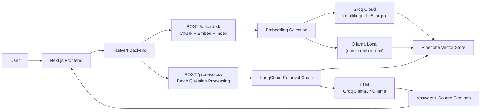

# Draft

> AI-powered RFP and security questionnaire automation. Upload your knowledge base, submit a questionnaire, get grounded answers with source citations in seconds.

<!-- Add screenshots here once available -->
<!-- <div align="center">


</div> -->

`Draft` is a full-stack RAG application built around FastAPI, Next.js, Pinecone and LangChain. You upload company knowledge base documents, the backend chunks and embeds the content into Pinecone's vector store, and then processes CSV questionnaires in batch, retrieving the most relevant context for each question and generating accurate, cited answers via Groq or Ollama.

The app is aimed at sales teams, security engineers and pre-sales consultants who spend hours manually answering repetitive RFPs and vendor assessments. Draft reduces that to seconds.

## What It Does

You upload knowledge base documents such as company info, security policies, product details and past proposals. The backend chunks, embeds and indexes the content in Pinecone. You then upload a CSV with a `Question` column and Draft processes each question through a LangChain retrieval chain, fetching the top `k=3` relevant chunks. Each answer is returned with source citations so you know exactly where it came from, and the results come back as a structured JSON payload ready to export.

## Tech Stack


### Frontend

Next.js `^15.0`, React `^19.0`, TypeScript `^5.x`, Tailwind CSS `^4.0`

### Backend

FastAPI `>=0.115,<1.0`, LangChain, Pinecone serverless (`multilingual-e5-large`, 1024 dims, cosine metric), Groq (Llama 3) for cloud inference, Ollama (`nomic-embed-text`) for local embeddings, `uv` for Python package management.

### Deployment

Frontend on Vercel, backend on Render.com via `render.yaml`, CI/CD via GitHub Actions.

## Architecture



### Embedding Selection

The system detects the environment at runtime. If `GROQ_API_KEY` is present it uses Pinecone's serverless embeddings (`multilingual-e5-large`, 1024 dims). Otherwise it falls back to Ollama local embeddings (`nomic-embed-text`, 768 dims). Draft works fully offline with Ollama or in production with Groq, no code changes needed.

## How the RAG Pipeline Works

### 1. Ingestion

The upload endpoint is `POST /upload-kb`. The backend receives the document, splits it using `RecursiveCharacterTextSplitter`, generates embeddings and upserts the vectors into Pinecone with metadata.

### 2. Embedding

Embeddings are generated per chunk. The dimension and model depend on the detected environment:

| Environment | Model | Dimensions |
|---|---|---|
| Cloud (Groq key present) | `multilingual-e5-large` | 1024 |
| Local (Ollama) | `nomic-embed-text` | 768 |

The Pinecone index must be pre-created with the matching dimension and cosine metric.

### 3. Processing

`POST /process-csv` accepts a CSV with a `Question` column. For each row, the question is embedded using the active embedding strategy, the top `k=3` relevant chunks are retrieved from Pinecone, those chunks are passed as context to the LLM via LangChain, and an answer is generated with source citations attached.

### 4. Retrieval

Standard top-k semantic retrieval via Pinecone cosine similarity. Results include chunk text and source metadata so every answer is traceable back to its origin document.

## Features

**Core:** knowledge base document upload and vector indexing, batch CSV questionnaire processing, per-answer source citations, environment-aware embedding strategy (cloud vs local), single-question evaluation endpoint, KB file listing and deletion with vector purge.

**AI and Retrieval:** Groq-powered cloud inference (Llama 3), Ollama local inference fallback, LangChain retrieval chain, Pinecone serverless vector store, multilingual embedding support.

**Infrastructure:** GitHub Actions CI/CD pipeline, Vercel frontend deployment, Render.com backend deployment via `render.yaml`, `uv` for fast reproducible Python environments.

## API Routes

### Knowledge Base

| Method | Path | Purpose |
|---|---|---|
| `POST` | `/upload-kb` | Upload, chunk, embed and index a document |
| `GET` | `/kb/files` | List all tracked knowledge base documents |
| `DELETE` | `/kb/files/{filename}` | Delete a document and purge its vectors from Pinecone |

### Questionnaire

| Method | Path | Purpose |
|---|---|---|
| `POST` | `/process-csv` | Process a CSV questionnaire and return answers with citations |
| `POST` | `/evaluate` | Single-question evaluation endpoint |

## Getting Started

### Prerequisites

Python 3.14, Node.js 20+, `uv` (Python package manager), a Pinecone account with an index named `draft-kb` at dimension `1024` with cosine metric, and a Groq API key or Ollama running locally.

### First-Time Setup

See [RUNBOOK.md](./RUNBOOK.md) for the full setup guide.

**Backend:**

```bash
cd draft-api
cp .env.example .env
# Add your PINECONE_API_KEY and GROQ_API_KEY to .env
uv pip install -r requirements.txt
```

**Frontend:**

```bash
cd draft-web
npm install
```

### Daily Startup

**Terminal 1 — Backend:**

```bash
cd draft-api
uv run uvicorn main:app --reload
```

Wait for `Application startup complete` before starting the frontend.

**Terminal 2 — Frontend:**

```bash
cd draft-web
npm run dev
```

Access the dashboard at `http://localhost:3000` and the API Swagger docs at `http://127.0.0.1:8000/docs`.

### Using Ollama locally

```bash
ollama pull llama3
ollama pull nomic-embed-text
```

Leave `GROQ_API_KEY` empty in your `.env` and the system detects Ollama automatically.

## Environment Variables

### Backend (`draft-api/.env`)

| Variable | Required | Purpose |
|---|---|---|
| `PINECONE_API_KEY` | Yes | Pinecone vector store access |
| `GROQ_API_KEY` | No | Groq cloud inference and embeddings |

### Frontend (`draft-web/.env.local`)

| Variable | Required | Purpose |
|---|---|---|
| `NEXT_PUBLIC_API_URL` | Yes | Backend API base URL |

## Deployment

Connect the `draft-web` folder to a Vercel project and set `NEXT_PUBLIC_API_URL` to your Render backend URL. The repo includes a `render.yaml` for one-click Render deployment. Set `GROQ_API_KEY` and `PINECONE_API_KEY` as environment variables in the Render dashboard.

**Live demo:** [draft-pink.vercel.app](https://draft-pink.vercel.app)

## Technical Highlights

The same codebase works fully local with Ollama or cloud-deployed with Groq, switching automatically based on the presence of an API key. Pinecone serverless handles vector storage with no infrastructure to manage and vectors persist across restarts. Every answer is grounded in retrieved context via LangChain, not hallucinated from model weights. An entire security questionnaire with 30 or more questions is processed in a single request. Pushes to main trigger automated deploy pipelines to Vercel and Render via GitHub Actions.

## Roadmap

Export to PDF and Word, shareable review link for team collaboration without login, inline answer editing and approval workflow, multi-tenant workspaces with isolated knowledge bases per organization, and confidence scoring per answer based on retrieval similarity scores.

See [IMPLEMENTATION_PLAN.md](./IMPLEMENTATION_PLAN.md) for the full plan.

## Repository Structure

```text
draft-api/
  main.py               FastAPI app entry point
  requirements.txt      Python dependencies
  render.yaml           Render deployment config
  .env.example          Environment variable template

draft-web/
  app/                  Next.js App Router pages
  components/           UI components
  lib/                  API client and utilities

.github/
  workflows/            GitHub Actions CI/CD pipelines
```

## Contact

GitHub: [github.com/ricardomadeira93](https://github.com/ricardomadeira93)
Portfolio: [use-forma-studio.vercel.app](https://use-forma-studio.vercel.app)
LinkedIn: [linkedin.com/in/ricardo-madeira-8ab393280](https://linkedin.com/in/ricardo-madeira-8ab393280)
