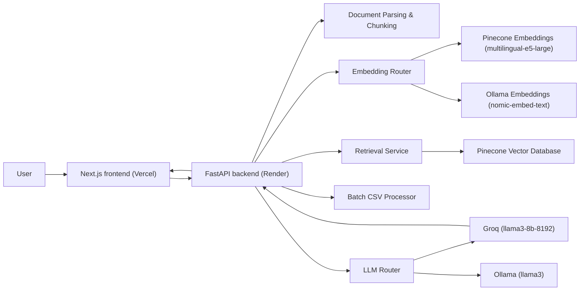

# DRAFT

> Production-grade RAG workspace for instantly auto-filling security questionnaires and RFPs from your company's knowledge base.

<div align="center">


</div>

`Draft` is a decoupled, full-stack RAG assistant built around FastAPI, Next.js, Pinecone, and LangChain (supporting Groq and Ollama). You upload company knowledge bases (PDFs, text), the backend chunks and embeds the content, stores vectors in Pinecone, and then processes massive CSV questionnaires row-by-row. The app is aimed at sales engineers and GTM teams who want to automate security questionnaires in seconds rather than weeks.

## What It Does

In plain English:

- You upload company documents (Knowledge Base) via the Dashboard.
- The backend chunks the text, embeds it via Pinecone serverless embeddings (or Nomic locally), and stores it in a Pinecone Vector Database.
- A client sends you an RFP (Request for Proposal) as an Excel/CSV file with 200+ questions.
- You upload the CSV to the Draft Workspace.
- The AI searches the vector database for every single question, generates a highly accurate answer, and attaches the exact source citations.
- You download the completed CSV.

## Tech Stack


### Frontend

- Next.js `^15.0.0`
- React `^19.0.0`
- Tailwind CSS `v4` (Dark Mode enabled)
- Lucide React

### Backend

- FastAPI `>=0.136,<1.0`
- LangChain Core / Groq / Pinecone / Ollama
- Pinecone Client `>=7.3.0`
- Python `3.14` managed via `uv`

## Architecture



### Storage layout

- `Pinecone Cloud`: Serverless Vector Database (`draft-kb` index)
- `backend/kb_tracker.db`: Local SQLite tracker for uploaded document metadata

## How the RAG Pipeline Actually Works

### 1. Ingestion

The upload endpoint is `POST /upload-kb`. The backend reads the document, applies a `RecursiveCharacterTextSplitter` (1000 chunk size, 200 overlap), and generates metadata including the source filename. 

### 2. Embeddings and Indexing

The `llm_router.py` automatically detects the environment:
- If `GROQ_API_KEY` is present, it uses Pinecone's serverless embedding model (`multilingual-e5-large`, 1024 dimensions) for lightning-fast cloud processing.
- Otherwise, it falls back to local `OllamaEmbeddings` (`nomic-embed-text`, 768 dimensions).
Vectors are upserted into the Pinecone `draft-kb` index.

### 3. Batch Processing (CSV)

When a CSV is uploaded to `POST /process-csv`, the backend streams through each row, extracts the "Question" column, and runs it through the LCEL (LangChain Expression Language) RAG chain asynchronously. 

### 4. Retrieval & Generation

The retriever pulls the top `k=3` most relevant chunks from Pinecone. The context is formatted and injected into a strict professional B2B RFP prompt template. The LLM (Groq or Ollama) generates the answer, and the exact source files and text snippets are extracted and returned alongside the answer.

## Features Present in the Codebase

### Core
- Massive CSV Questionnaire Processing
- Evaluation Dashboard for single-question testing
- Knowledge Base Management (Upload/Delete documents)
- Theme Toggle (Light/Dark mode)
- Modern SaaS UI with soft squircle cards and gradient backgrounds

### AI / Retrieval
- Hybrid Router: Cloud-first (Groq) with Local-fallback (Ollama)
- Lazy Singleton initialization for database connections to prevent cold-start crashes
- Source attribution and citation tracking
- Highly constrained RFP system prompting to prevent hallucination

## API Surface

### Knowledge Base

| Method | Path | Purpose |
|---|---|---|
| `POST` | `/upload-kb` | Upload, chunk, embed, and index a document |
| `GET` | `/kb/files` | List all tracked documents |
| `DELETE` | `/kb/files/{filename}` | Delete document and purge vectors |

### RFP Processing

| Method | Path | Purpose |
|---|---|---|
| `POST` | `/process-csv` | Upload a CSV and return answers + sources |
| `POST` | `/evaluate` | Test a single question and inspect retrieved chunks |

## Getting Started

### Prerequisites

- `uv` (Fast Python Package Manager)
- Node.js 20+
- `pnpm`
- Pinecone API Key (Dimension: 1024, Metric: Cosine, Name: `draft-kb`)
- Groq API Key

### Run locally

Backend:

```bash
cd rfpilot-api
uv pip install -r requirements.txt
uv run uvicorn main:app --reload
```

Frontend:

```bash
cd rfpilot-web
npm install
npm run dev
```

## Environment Variables

### Backend (`rfpilot-api/.env`)

| Variable | Purpose |
|---|---|
| `PINECONE_API_KEY` | Required for vector storage |
| `GROQ_API_KEY` | Required for Cloud Inference (Llama 3) |

### Frontend (`rfpilot-web/.env.local`)

| Variable | Purpose |
|---|---|
| `NEXT_PUBLIC_API_URL` | Points to backend (default: `http://127.0.0.1:8000`) |

## Production Deployment

This project is built to be deployed on serverless architecture:
1. **Frontend**: Deploy `rfpilot-web` to Vercel. Set `NEXT_PUBLIC_API_URL` to the Render backend URL.
2. **Backend**: Deploy `rfpilot-api` to Render.com using the included `render.yaml` blueprint. Set `GROQ_API_KEY` and `PINECONE_API_KEY` in the Render environment settings.
